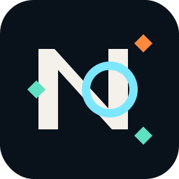
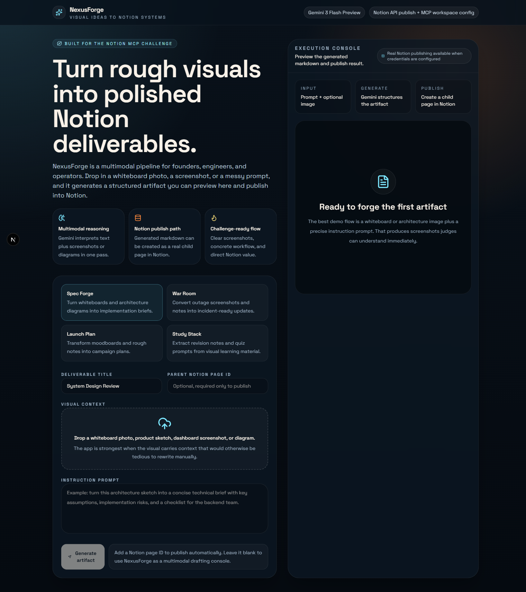
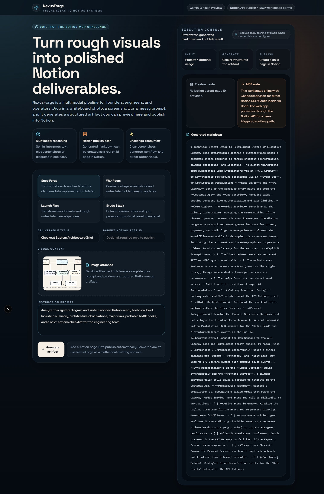
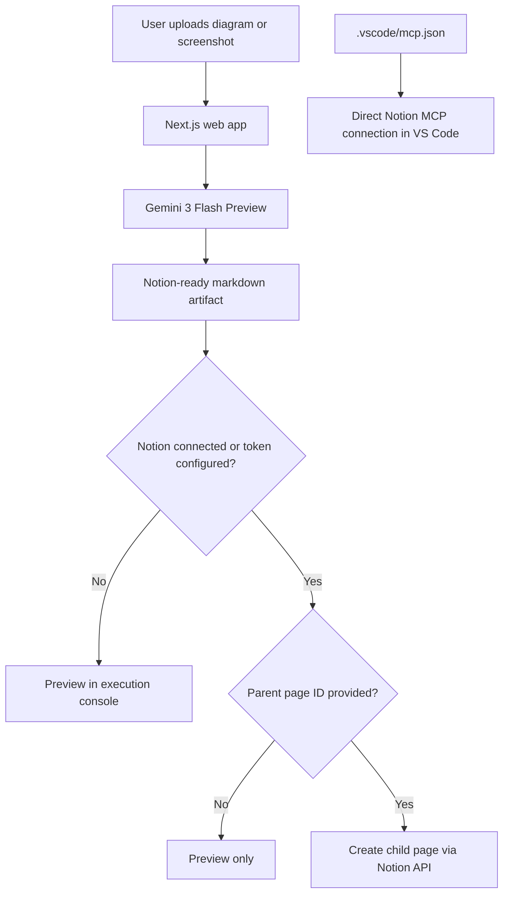

<div align="center">
  
  <h1>NexusForge</h1>
  <p>Turn rough visuals into polished Notion deliverables.</p>
  <p>
    
    
    
    
  </p>
</div>

## Overview
NexusForge is a challenge-focused multimodal workflow app for Notion. It takes a screenshot, whiteboard photo, product sketch, or architecture diagram plus a text prompt, uses Gemini 3 Flash Preview to generate structured markdown, and then publishes that result into Notion as a child page.

It now supports two Notion auth paths:
- Connect Notion with OAuth from the app UI
- Fall back to `NOTION_API_KEY` for a workspace token based setup

The project also includes workspace-level Notion MCP configuration in [.vscode/mcp.json](./.vscode/mcp.json) so the repo itself is ready for direct Notion MCP OAuth inside VS Code.

## Why This Is Different
- It is built around a concrete workflow, not a generic chat wrapper.
- It demonstrates multimodal input with a real generated artifact.
- It uses an honest split between Notion MCP for workspace tooling and the Notion API for user-triggered web publishing.
- It is screenshot-ready for challenge submission and portfolio use.

## Screenshots
### Landing state


### Generated technical brief from an uploaded system diagram


## Core Flow


## What It Can Generate
- Engineering briefs from architecture diagrams
- Incident summaries from dashboards or alert screenshots
- Campaign plans from moodboards and rough launch notes
- Study guides from notes and visual learning material

## Stack
- Next.js 16 App Router
- Tailwind CSS 4
- Framer Motion
- Google GenAI SDK
- Notion API
- Notion MCP workspace config

## Local Setup
1. Copy [.env.example](./.env.example) to `.env.local`
2. Set `GEMINI_API_KEY`
3. Set Notion auth using either OAuth or a workspace token
4. Run `npm install`
5. Run `npm run dev`

Example `.env.local`:

```bash
GEMINI_API_KEY=your_gemini_key
NOTION_API_KEY=your_notion_integration_token
NOTION_OAUTH_CLIENT_ID=your_public_integration_client_id
NOTION_OAUTH_CLIENT_SECRET=your_public_integration_client_secret
NOTION_OAUTH_REDIRECT_URI=https://your-domain.vercel.app/api/notion/callback
```

## Notion Setup
### Option A: OAuth connect from the app
1. Create a public Notion integration with redirect URI `/api/notion/callback`.
2. Set the three OAuth env vars.
3. Use the `Connect Notion` button in the app.
4. After connecting, paste a parent page ID and publish.

### Option B: Internal integration token
1. Create an internal Notion integration and grant it insert content access.
2. Set `NOTION_API_KEY`.
3. Share the parent Notion page with that integration.
4. Paste the parent page ID into the app.
5. Generate the artifact and publish.

In both cases, the parent Notion page must be accessible to the token or connected integration.

## MCP Setup In VS Code
This repo already includes [.vscode/mcp.json](./.vscode/mcp.json):

```json
{
  "servers": {
    "notion": {
      "type": "http",
      "url": "https://mcp.notion.com/mcp"
    }
  }
}
```

Use `MCP: List Servers` in VS Code and complete the OAuth flow for Notion.

## Demo Asset
The repo includes a reusable sample system diagram at [public/demo-system-map.png](./public/demo-system-map.png) so the multimodal flow can be demonstrated consistently.

## Challenge Fit
- Originality: a concrete “diagram to spec” workflow instead of generic AI notes.
- Technical complexity: multimodal Gemini processing, Notion OAuth, Notion publishing, and MCP workspace integration.
- Practicality: useful for engineering, operations, marketing, and learning workflows.

## Scripts
- `npm run dev`
- `npm run build`
- `npm run lint`
- `npm run start`

## License
MIT
