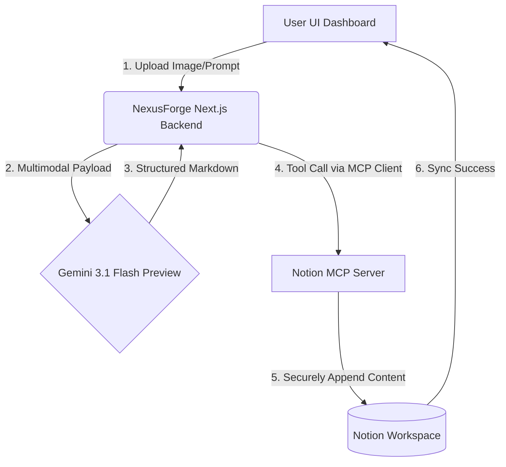

<div align="center">
  
  <h1>🌌 NexusForge: The Multimodal Notion Workhub</h1>
  <p>An intelligent agent bridging Gemini's Multimodal magic with Notion using Model Context Protocol (MCP).</p>
</div>

---

## 🛠️ The Vision
NexusForge turns your static Notion databases into dynamic, intelligent agents. By leveraging the **Notion MCP**, NexusForge safely tunnels into your Notion workspace, while **Gemini-3-Flash-Preview** brings lightning-fast, multimodal AI reasoning.

Imagine dropping an architecture diagram (image), a PDF spec, or a whiteboard sketch into NexusForge, and having it autonomously generate tickets, append summaries, or draft code right back into your Notion workspace.

### 🔥 Features
- 🧠 **Multimodal Processing:** Native support for Gemini-3-Flash-Preview. Pass images, docs, and text.
- ⚡ **Notion MCP Integration:** Uses robust contextual tools (not brittle APIs) scaling securely with Model Context Protocol.
- ✨ **Automated Workflow Orchestration:** Extracts backlog > Processes via AI > Injects drafts into Notion pages. 

---

## 🏗️ Architecture Flowchart


---

## 💻 Tech Stack
- **Framework:** `Next.js 15 (App Router)`
- **Styling:** `Tailwind CSS`, `Framer Motion`
- **AI Brain:** `Google GenAI SDK (gemini-3-flash-preview)`
- **Integration:** `@modelcontextprotocol/sdk` (Notion MCP)
- **Deployment:** `Vercel`

---

## 🚀 Getting Started

### Prerequisites
1. Get a Gemini API Key: [Google AI Studio](https://aistudio.google.com/)
2. Set up Notion Integrations Token.
3. Install standard MCP infrastructure.

```bash
# Clone the repository
git clone https://github.com/yourusername/nexus-forge.git
cd nexus-forge

# Install Dependencies
npm install

# Set Environment Variables
echo "GEMINI_API_KEY=your_key_here" > .env.local

# Run the Dev Server
npm run dev
```

---

### Challenge Submission Notes
This app was built specifically for the [Notion MCP DEV.to Challenge](https://dev.to/challenges/notion-2026-03-04). 
**Originality:** Directly implements multimodal pipelines with Notion.
**Complexity:** Merges latest Next.js with GenAI SDK and MCP protocol pipelines.

<p align="center">Made with ❤️ for the Notion & DEV community.</p>
