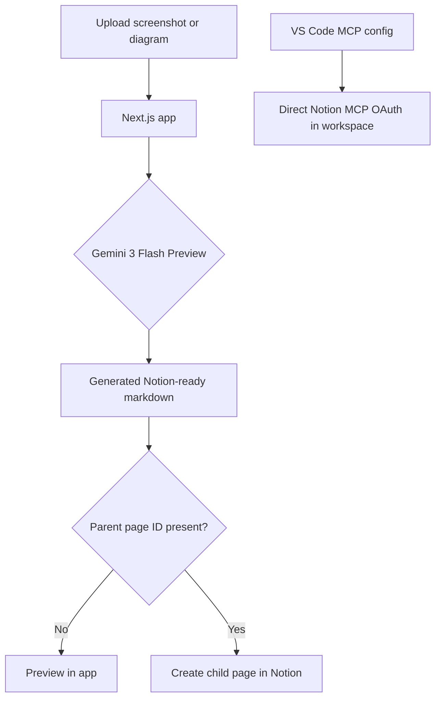

*This is a submission for the [Notion MCP Challenge](https://dev.to/challenges/notion-2026-03-04)*

## What I Built
**NexusForge** is a multimodal workflow app for Notion. It turns screenshots, whiteboard photos, rough sketches, and messy prompts into structured Notion-ready deliverables.

The strongest workflow in the app is **diagram to technical brief**: upload a system design image, ask for a concise engineering summary, and NexusForge produces a clean markdown artifact that can be previewed immediately and published into Notion as a child page.

I built it to solve a very practical problem: visual thinking happens early, but documentation usually happens later and manually. NexusForge closes that gap.

It combines:
- **Gemini 3 Flash Preview** for multimodal understanding
- **Notion API** for creating real pages from generated markdown
- **Notion MCP configuration** in the workspace so the repo is ready for direct Notion MCP OAuth in VS Code

## Video Demo
*(Placeholder for Video URL showing image upload and Notion auto-population)*

## Screenshots
### Landing page


### Generated result from an uploaded system map


## Structure Flowchart
Let's see how the internal pipeline operates using this diagram:



## Setup & Implementation Guide
### 1. The Multimodal Intelligence
I used `@google/genai` with `gemini-3-flash-preview` so NexusForge can reason about both text and images in one request. That makes screenshots and architecture diagrams first-class input instead of just attachments.

```typescript
const contents = [
  {
    text: `${buildSystemPrompt(mode)}\n\nUser request: ${prompt.trim()}`,
  },
];

if (imageBase64) {
  const [meta, data] = imageBase64.split(",");
  const mimeType = meta.split(":")[1]?.split(";")[0] ?? "image/png";
  contents.push({
    inlineData: { data, mimeType },
  });
}

const response = await ai.models.generateContent({
  model: "gemini-3-flash-preview",
  contents,
});
```

### 2. The Notion Publishing Path
For the web app runtime, I use the Notion API to create a real child page under a selected parent page. This keeps the publishing path deterministic and easy to demo:

```typescript
const response = await fetch("https://api.notion.com/v1/pages", {
  method: "POST",
  headers: {
    Authorization: `Bearer ${notionApiKey}`,
    "Content-Type": "application/json",
    "Notion-Version": "2026-03-11",
  },
  body: JSON.stringify({
    parent: { page_id: cleanParentId },
    properties: {
      title: {
        title: [{ text: { content: title } }],
      },
    },
    markdown,
  }),
});
```

### 3. Where MCP Fits
The repo also includes `.vscode/mcp.json` pointing at `https://mcp.notion.com/mcp`, so the workspace itself is ready for direct Notion MCP authentication inside GitHub Copilot or other MCP-capable tools in VS Code.

That means the project demonstrates two complementary ideas:
- **Web app publishing flow** for end users
- **Workspace MCP integration** for AI-assisted Notion operations while developing

## Why This Stands Out In The Challenge
- It is not just “chat with Notion”. It is a concrete production-style workflow.
- It shows off **multimodality** in a way judges can understand immediately.
- It uses Notion in a way that feels native: generating polished artifacts and pushing them directly into a workspace.
- It is practical across engineering, operations, marketing, and study workflows.

## Future Scope
- Add PDF and document ingestion for richer multimodal pipelines.
- Add template-aware publishing into specific Notion databases.
- Add polling and human-in-the-loop approval flows for recurring workflows.

Thank you to Notion and DEV! NexusForge aims to redefine exactly how interactive and automated workspaces should feel!
