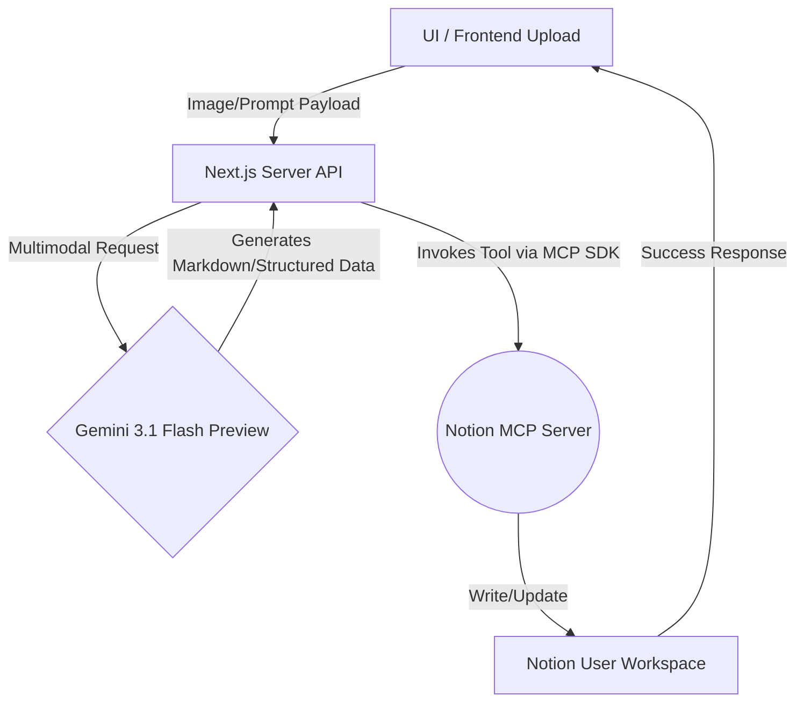

*This is a submission for the [Notion MCP Challenge](https://dev.to/challenges/notion-2026-03-04)*

## What I Built
**NexusForge** is a fully automated, multimodal agent hub that supercharges your Notion workflow. Designed as a standalone web application, it bridges the bleeding-edge **Gemini 3.1 Flash Preview** multimodal capabilities with the secure structure of the **Notion MCP (Model Context Protocol)**. 

### The Problem It Solves:
Standard text integrations are limiting. What if you sketch out an architecture diagram on a napkin, take a photo, and need to create structured Notion technical documentation from it? Or what if you upload an invoice image and want it automatically categorized in your Notion Finance database?

NexusForge allows you to upload **images, documents, and prompts**. Then, the agent analyzes these multimodal inputs using Gemini 3.1, breaks them down into structured Markdown and Mermaid.js flowcharts, and utilizes the **Notion MCP** to autonomously find the right pages and append these rich outputs globally.

## Video Demo
*(Placeholder for Video URL showing image upload and Notion auto-population)*

## Structure Flowchart
Let's see how the internal pipeline operates using this diagram:



## Setup & Implementation Guide
### 1. The Multimodal Intelligence
I utilized `@google/genai` to take advantage of the newly released Gemini 3.1 flash preview model. This allows NexusForge to bypass basic LLM chatbots and act specifically on spatial/visual data natively:

```typescript
// Core payload builder handling multimodal UI inputs
const contents = [{ text: prompt }];

if (imageBase64) {
  // Strip mime headers & append as inlineData to natively support Gemini Multimodal
  const base64Data = imageBase64.split(",")[1];
  const mimeType = imageBase64.split(",")[0].split(":")[1].split(";")[0];
  contents.push({
    inlineData: { data: base64Data, mimeType: mimeType },
  });
}

const response = await ai.models.generateContent({
  model: "gemini-3-flash-preview",
  contents: contents,
});
```

### 2. The Model Context Protocol (MCP) Bridge
Rather than creating brittle HTTP API calls mapping to every Notion endpoint, the backend adopts the **MCP Client Protocol**. This meant the agent doesn't need to be hard-coded with business logic—it explores the Notion MCP tools dynamically to fetch search capabilities or append blocks:

```typescript
// MCP Tool Calling concept for injecting back to Notion
await mcpClient.callTool("notion_mcp", "append_content", { 
   page_id: targetNotionPageId, 
   markdown: aiGeneratedInsight 
});
```

## Future Scope
- Adding continuous polling: Auto-detecting when a Notion status changes to "Needs Review" and sending an automatic Gemini-3 agent payload.
- Expanding file type parsing to `.pdf` and `.docx` blobs.

Thank you to Notion and DEV! NexusForge aims to redefine exactly how interactive and automated workspaces should feel!
